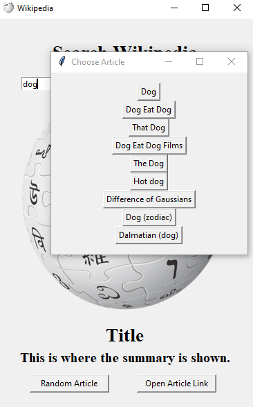
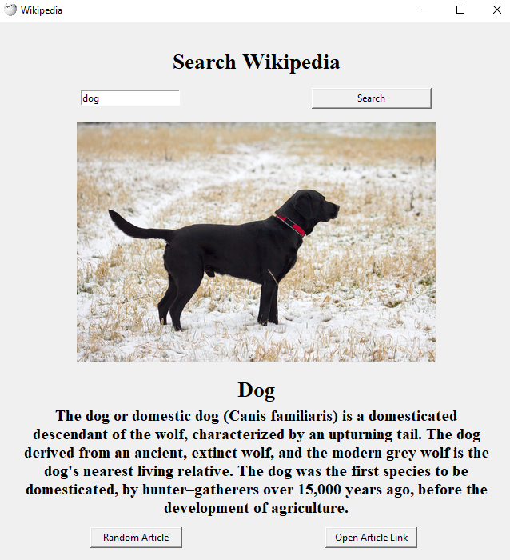

# Wikipedia-Desktop-App
A Wikipedia Desktop App that gives you the summary, images and full data of the query searched. Made with Tkinter.
# Installation
```
$ pip install -r requirements.txt
```
# Usage
- Type the query in the Entry.
- Click 'Search' and that's it. You can view the summary and the images.
- Click on the image being displayed to view the next one.
- Click 'Random Article' to get a random article's data.
- Click 'Open Article Link' to open the article's link in your web browser.
# Preview



